# EXPERIMENT NO. 1 
# Android Development Environment 
# To study design aspects of development environment like Android, iOS 
**Introduction** 
This experiment aims to study the design aspects of mobile development environments, focusing on Android and iOS. The goal is to understand the tools, frameworks, and best practices used in the development of mobile applications for these platforms. 
## Android Development Environment 
### 1. Programming Languages 
- **Java :** The primary language for Android development for many years. 
- **Kotlin :** Officially supported by Google and preferred for new Android applications due to its modern features and interoperability with Java. 
### 2. Integrated Development Environment (IDE) 
- **Android Studio :** The official IDE for Android development, based on IntelliJ IDEA. It includes features like code completion, debugging, and a powerful layout editor. 
### 3. Software Development Kit (SDK) 
- **Android SDK :** Provides the tools necessary to build, test, and debug Android applications. Includes the Android emulator platform tools, and various libraries. 
### 4. Build System 
- **Gradle :** The build automation tool used in Android Studio to compile, package, and manage dependencies for Android projects. 
### 5. Emulator 
- **Android Emulator :** Part of the Android SDK, it allows developers to run and test applications on virtual devices with different configurations and Android versions. 
### 6. User Interface Design 
- **XML Layouts :** UI components are typically defined in XML files. 
- **Jetpack Compose :** A modern toolkit for building native UI using declarative programming. 
### 7. Testing 
- **JUnit :** For unit testing. 
- **Espresso :** For UI testing. 
- **Robolectric :** For running tests on the JVM without an emulator. 
 
## iOS Development Environment 
### 1. Programming Languages 
- **Objective-C :** An older language used for iOS development. 
- **Swift :** The modern language for iOS development, designed to be safe, fast, and expressive. 
### 2. Integrated Development Environment (IDE) 
- **Xcode :** The official IDE for iOS development, which includes a code editor, debugger, and Interface Builder for designing user interfaces. 
### 3. Software Development Kit (SDK) 
- **iOS SDK :** Provides the necessary tools and frameworks for developing iOS applications. Includes libraries like UIKit Foundation, and Core Data. 
### 4. Build System 
- **Xcode Build System :** Integrated into Xcode for compiling, packaging, and managing dependencies. 
### 5. Simulator 
- **iOS Simulator :** Allows developers to test and debug applications on virtual devices with different iOS versions and device configurations. 
### 6. User Interface Design 
- **Storyboard and XIB files :** Interface Builder within Xcode is used to design UIs visually. 
- **SwiftUI :** A modern declarative framework for building UI across all Apple platforms. 
### 7. Testing 
- **XCTest :** For unit and UI testing. 
- **Quick/Nimble :** Popular third-party frameworks for behavior-driven development (BDD). 
 
---
 
# EXPERIMENT NO. 2 
# Android Development Environment 
# To Setup Android Studio2 and study its Basic Components 
## 1. Downloading and Installing Android Studio 
- **Download Android Studio :** Visit the official Android Studio download page 
(https://developer.android.com/studio) and download the latest version for your operating system. 
 


Figure 2.1 Download Android Studio 
- **Install Android Studio :** Run the downloaded installer and follow the on-screen instructions to install Android Studio. Ensure you install the necessary SDK components during the installation process. 
 
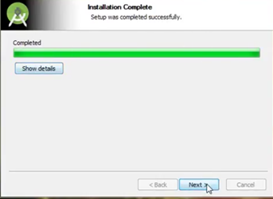

Figure 2.2 Android Studio Installation 
## 2. Setting Up Android Studio 
- **Launch Android Studio :** Open Android Studio after installation. 
- **Welcome Screen :** On the welcome screen, you have various options.  

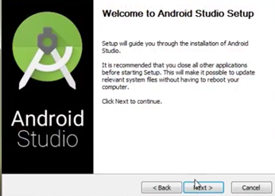

Figure 2.3 Android Studio Setup 
- **Create a New Project :** Select "Start a new Android Studio project." 

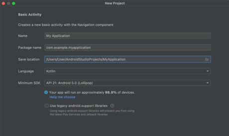 

Figure 2.4 Creating a new project 
- **Configure Your Project :** Provide the project name, package name, save location, language (Java/Kotlin), and minimum API level. 
- **Select Activity Template :** Choose an activity template, like "Empty Activity," for simplicity.  

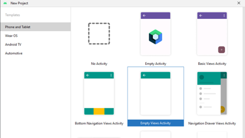

Figure 2.5 New Project 
- **Finish Setup :** Click "Finish" to complete the setup and open your new project. 

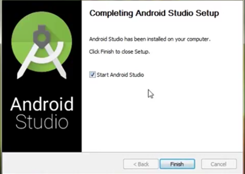

Figure 2.6 Finish Setup 
## 3. Understanding Basic Components of Android Studio 
- **Project Structure :** The main components of your project will include: 
    - **Java/Kotlin Files :** Located in the `app/src/main/java` directory. These files contain your app’s source code. 
    - **XML Layout Files :** Located in the `app/src/main/res/layout` directory. These files define the UI of your app. 
    - **AndroidManifest.xml :** Located in the `app/src/main` directory. This file contains essential information about your app including its components and permissions. 

- **Android Studio Layout :**
    - **Toolbar :** Provides quick access to frequently used actions and tools. 
    - **Project Explorer :** Located on the left side, it shows the structure of your project. 
    - **Editor Window :** The central area where you write and edit your code. 
    - **Logcat :** Located at the bottom, it displays system messages, including log messages from your app. 
    - **Emulator/Device Manager :** Allows you to create and manage virtual devices to test your app. 

## 4. Creating and Running a Basic App 
- **Create a Simple App :** 
    - **Open `activity_main.xml` and add some UI elements like a `TextView` or `Button`.** 
    - **Open `MainActivity.java` and write some basic code to handle UI interactions.**
- **Run the App :** 
    - **Click the "Run" button on the toolbar.** 
    - **Choose a virtual device or connect a physical device via USB.**
    - **Android Studio will build and install the app on the selected device.** 

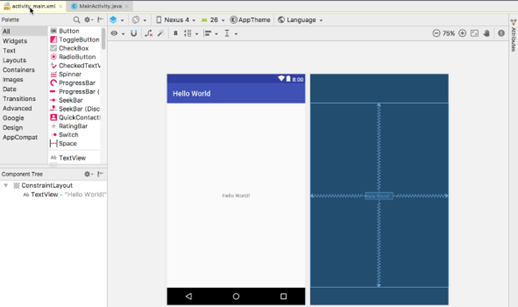

Figure 2.7 Creating a Basic App  

---

# EXPERIMENT NO. 3 
# Android User Interface Design 
# To study various XML Files needed for interface design 
In Android User Interface (UI) design, XML (Extensible Markup Language) files are crucial for defining the layout and appearance of the app's user interface. Here's an explanation of the various XML files you might encounter: 
## 1. Layout XML Files (activity_main.xml, fragment_example.xml) 
- **Purpose:** Define the structure and layout of UI components (buttons, text fields, and images) on the screen. 
- **Components:** 
    - **ViewGroups:** Containers like LinearLayout, RelativeLayout, ConstraintLayout, etc., that define how child views are arranged. 
    - **Views:** Individual UI elements like Button, TextView, ImageView, etc. 
## 2. Resource XML Files 
- **Purpose:** Define custom shapes, gradients, and states for UI elements. 
- **Components:**  
    - **<shape>:** Defines the shape and appearance of the drawable.  
    - **<selector>:** Used to create state-based drawables (e.g., changing the button color when pressed). Values XML Files values strings.xml, values/colors.xml, values/styles.xml) 
- **Purpose:** Store common values used across the app, such as strings, colors, and styles. 
- **Components:** 
    - **<string>:** Defines text strings. 
    - **<color>:** Defines color resources. 
    - **<style>:** Defines a collection of attributes for consistent UI design. 

## 3. Manifest XML File (AndroidManifest.xml) 
- **Purpose:** Describes the app’s essential information (components, permissions, and hardware features) 
- **Components:** 
    - **<activity>:** Declares an activity in the app. 
    - **<permission>:** Specifies permissions required by the app. 
    - **<intent-filter>:** Defines how an activity responds to different intents. 

## 4. Menu XML Files (menu/menu_main.xml) 
- **Purpose:** Define the structure of menus in the app (options menus, context menus, or popup menus) 
- **Components:** 
    - **<menu>:** The root element that can contain multiple <item> elements. 
    - **<item>:** Represents individual menu items with attributes like title, icon, and id. 

## 5. Navigation XML Files (navigation/nav_graph.xml) 
- **Purpose:** Used to define navigation flow within an app using the Navigation component. 
- **Components:** 
  - **<navigation>:** The root element that defines the navigation graph. 
  - **<fragment>:** Represents individual fragments and their navigation actions. 

## 6. Animator XML Files (animator/fade_in.xml, animator/slide_out.xml) 
- **Purpose:** Define animations for UI transitions or interactions. 
- **Components:** 
    - **<objectAnimator>:** Defines property animations for views. 

## 7. Layout XML Files for Different Configurations (layout/activity_main.xml, layout-land/activity_main.xml) 
- **Purpose:** Define different layouts for different screen sizes or orientations (e.g., portrait vs. landscape). 
- **Components:** Similar to standard layout files but tailored for specific configurations. 
 
---

# EXPERIMENT NO. 4 
# Android User Interface Design 
# To implement different type of layouts like relative, grid, linear and table. 
## A) Develop a program to implement constraint layout to display Hello World on screen. 
**CODE :-**  
```xml
<?xml version="1.0" encoding="utf-8"?> 
<androidx.constraintlayout.widget.ConstraintLayout 
xmlns:android="http://schemas.android.com/apk/res/android" 
    xmlns:app="http://schemas.android.com/apk/res-auto" 
    xmlns:tools="http://schemas.android.com/tools" 
    android:id="@+id/constraintLayout" 
    android:layout_width="match_parent" 
    android:layout_height="match_parent" 
    android:background="#FFEBEE" 
    tools:context=".MainActivity"> 
    <TextView 
        android:id="@+id/textView" 
        android:layout_width="wrap_content" 
        android:layout_height="wrap_content" 
        android:text="Hello World" 
        android:textSize="24sp" 
        android:textColor="@android:color/black" 
        app:layout_constraintBottom_toBottomOf="parent" 
        app:layout_constraintLeft_toLeftOf="parent" 
        app:layout_constraintRight_toRightOf="parent" 


 
        app:layout_constraintTop_toTopOf="parent" /> 
</androidx.constraintlayout.widget.ConstraintLayout>
```
**OUTPUT :-** 


Figure 4.1 Constrait Layout  
--- 

## B) Develop a program to implement linear layout to display send message and registration form (vertical and horizontal) 
CODE :- 
```xml  
<com.google.android.material.textfield.TextInputLayout 
    android:layout_width="match_parent" 
    android:layout_height="wrap_content" 
    android:layout_marginBottom="10dp" 
    app:hintTextColor="@color/your_hint_color" 
    app:boxStrokeColor="@color/red"   <!-- This sets the color of the underline --> 


 
    app:boxStrokeErrorColor="@color/red" <!-- This sets the color of the underline when there's an 
error --> 
    <!-- Optional: Customize other styles --> 
    app:boxBackgroundMode="outline"> 
    <EditText 
        android:id="@+id/toField" 
        android:layout_width="match_parent" 
        android:layout_height="wrap_content" 
        android:hint="To" 
        android:inputType="textEmailAddress" 
        android:padding="10dp" /> 
</com.google.android.material.textfield.TextInputLayout> 
```
---
**OUTPUT :-** 

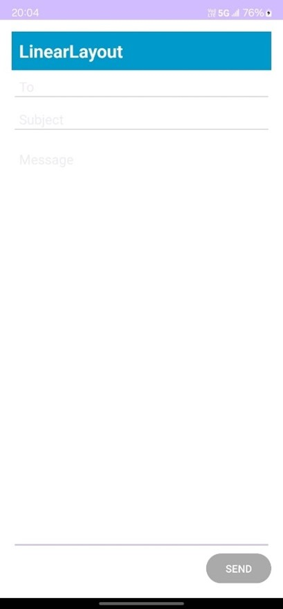

Figure 4.2 Linear Layout  
 
## C) Develop a program to implement relative layout to display Login and sign up form. 
**CODE :-**  
```xml 
<RelativeLayout 
    xmlns:android="http://schemas.android.com/apk/res/android" 
    android:layout_width="match_parent" 
    android:layout_height="match_parent" 
    android:background="#0078FF"> <!-- Light blue background --> 
    <!-- Login Form --> 
    <LinearLayout 
        android:id="@+id/login_layout" 
        android:layout_width="157dp" 
        android:layout_height="482dp" 
        android:layout_alignParentLeft="true" 
        android:layout_centerVertical="true" 
        android:layout_marginLeft="15dp" 
        android:layout_marginTop="50dp" 
        android:background="#FFFFFF" 
        android:elevation="8dp" 
        android:orientation="vertical" 
        android:padding="16dp"> 
        <TextView 
            android:layout_width="wrap_content" 
            android:layout_height="wrap_content" 
            android:layout_gravity="center_horizontal" 


 
            android:text="Login" 
            android:textColor="#000000" 
            android:textSize="24sp" 
            android:textStyle="bold" /> 
        <EditText 
            android:id="@+id/editTextEmailLogin" 
            android:layout_width="match_parent" 
            android:layout_height="wrap_content" 
            android:layout_marginTop="16dp" 
            android:backgroundTint="#D3D3D3" 
            android:hint="Email" 
            android:inputType="textEmailAddress" 
            android:textColor="#000000" 
            android:textColorHint="#A9A9A9" /> 
        <EditText 
            android:id="@+id/editTextPasswordLogin" 
            android:layout_width="match_parent" 
            android:layout_height="wrap_content" 
            android:layout_marginTop="8dp" 
            android:backgroundTint="#D3D3D3" 
            android:hint="Password" 
            android:inputType="textPassword" 
            android:textColor="#000000" 
            android:textColorHint="#A9A9A9" /> 
        <TextView 


 
            android:id="@+id/forgotPassword" 
            android:layout_width="wrap_content" 
            android:layout_height="wrap_content" 
            android:layout_gravity="center_horizontal" 
            android:layout_marginTop="8dp" 
            android:text="Forgot password?" 
            android:textColor="#0078FF" /> 
        <Button 
            android:id="@+id/buttonLogin" 
            android:layout_width="match_parent" 
            android:layout_height="wrap_content" 
            android:layout_marginTop="16dp" 
            android:backgroundTint="#0078FF" 
            android:text="Login" 
            android:textColor="#FFFFFF" /> 
        <!-- Social Login Options for Login --> 
        <TextView 
            android:id="@+id/loginOrSeparator" 
            android:layout_width="wrap_content" 
            android:layout_height="wrap_content" 
            android:layout_gravity="center_horizontal" 
            android:layout_marginTop="16dp" 
            android:text="Or" 
            android:textColor="#A9A9A9" /> 
        <Button 


 
            android:id="@+id/buttonLoginFacebook" 
            android:layout_width="match_parent" 
            android:layout_height="wrap_content" 
            android:layout_marginTop="8dp" 
            android:backgroundTint="#4267B2" 
            android:drawableStart="@drawable/fb" 
            android:text="Continue with Facebook" 
            android:textColor="#FFFFFF" /> 
        <Button 
            android:id="@+id/buttonLoginGoogle" 
            android:layout_width="match_parent" 
            android:layout_height="wrap_content" 
            android:layout_marginTop="8dp" 
            android:backgroundTint="#DB4437" 
            android:drawableStart="@drawable/google" 
            android:text="Continue with Google" 
            android:textColor="#FFFFFF" /> 
    </LinearLayout> 
    <!-- Signup Form --> 
    <LinearLayout 
        android:id="@+id/signup_layout" 
        android:layout_width="156dp" 
        android:layout_height="483dp" 
        android:layout_alignParentRight="true" 
        android:layout_centerVertical="true" 


 
        android:layout_marginTop="50dp" 
        android:layout_marginRight="10dp" 
        android:background="#FFFFFF" 
        android:elevation="8dp" 
        android:orientation="vertical" 
        android:padding="16dp"> 
        <TextView 
            android:layout_width="wrap_content" 
            android:layout_height="wrap_content" 
            android:layout_gravity="center_horizontal" 
            android:text="Signup" 
            android:textColor="#000000" 
            android:textSize="24sp" 
            android:textStyle="bold" /> 
        <EditText 
            android:id="@+id/editTextEmailSignup" 
            android:layout_width="match_parent" 
            android:layout_height="wrap_content" 
            android:layout_marginTop="16dp" 
            android:backgroundTint="#D3D3D3" 
            android:hint="Email" 
            android:inputType="textEmailAddress" 
            android:textColor="#000000" 
            android:textColorHint="#A9A9A9" /> 
        <EditText 


 
            android:id="@+id/editTextPasswordSignup" 
            android:layout_width="match_parent" 
            android:layout_height="wrap_content" 
            android:layout_marginTop="8dp" 
            android:backgroundTint="#D3D3D3" 
            android:hint="Create password" 
            android:inputType="textPassword" 
            android:textColor="#000000" 
            android:textColorHint="#A9A9A9" /> 
        <EditText 
            android:id="@+id/editTextConfirmPasswordSignup" 
            android:layout_width="match_parent" 
            android:layout_height="wrap_content" 
            android:layout_marginTop="8dp" 
            android:backgroundTint="#D3D3D3" 
            android:hint="Confirm password" 
            android:inputType="textPassword" 
            android:textColor="#000000" 
            android:textColorHint="#A9A9A9" /> 
        <Button 
            android:id="@+id/buttonSignup" 
            android:layout_width="match_parent" 
            android:layout_height="wrap_content" 
            android:layout_marginTop="16dp" 
            android:backgroundTint="#0078FF" 


 
            android:text="Signup" 
            android:textColor="#FFFFFF" /> 
        <!-- Social Signup Options --> 
        <TextView 
            android:id="@+id/signupOrSeparator" 
            android:layout_width="wrap_content" 
            android:layout_height="wrap_content" 
            android:layout_gravity="center_horizontal" 
            android:layout_marginTop="16dp" 
            android:text="Or" 
            android:textColor="#A9A9A9" /> 
        <Button 
            android:id="@+id/buttonSignupFacebook" 
            android:layout_width="match_parent" 
            android:layout_height="wrap_content" 
            android:layout_marginTop="8dp" 
            android:backgroundTint="#4267B2" 
            android:drawableStart="@drawable/fb" 
            android:text="Continue with Facebook" 
            android:textColor="#FFFFFF" /> 
        <Button 
            android:id="@+id/buttonSignupGoogle" 
            android:layout_width="match_parent" 
            android:layout_height="wrap_content" 
            android:layout_marginTop="8dp" 


 
            android:backgroundTint="#DB4437" 
            android:drawableStart="@drawable/google" 
            android:text="Continue with Google" 
            android:textColor="#FFFFFF" /> 
    </LinearLayout> 
</RelativeLayout> 
``` 
**OUTPUT :-**


Figure 4.3 Relative Layout 

## D) Develop a program to implement table layout to display calculator. 
**CODE :-** 
```xml  
<?xml version="1.0" encoding="utf-8"?> 
<LinearLayout xmlns:android="http://schemas.android.com/apk/res/android" 


 
    android:layout_width="match_parent" 
    android:layout_height="match_parent" 
    android:orientation="vertical" 
    android:padding="8dp" 
    android:gravity="center" 
    android:background="#f0f0f0"> 
    <!-- Display Area for Results --> 
    <TextView 
        android:id="@+id/display" 
        android:layout_width="match_parent" 
        android:layout_height="0dp" 
        android:layout_marginBottom="8dp" 
        android:layout_weight="1" 
        android:background="#FFFFFF" 
        android:gravity="end|center_vertical" 
        android:padding="16dp" 
        android:text="0" 
        android:textColor="#000000" 
        android:textSize="36sp" /> 
    <!-- TableLayout for Calculator Buttons --> 
    <TableLayout 
        android:layout_width="match_parent" 
        android:layout_height="0dp" 
        android:layout_weight="3" 
        android:shrinkColumns="*" 


 
        android:stretchColumns="*"> 
        <!-- First Row (AC, (), %, /) --> 
        <TableRow 
            android:layout_width="match_parent" 
            android:layout_height="0dp" 
            android:layout_weight="1"> 
            <Button 
                android:id="@+id/btn_clear" 
                android:layout_width="0dp" 
                android:layout_height="match_parent" 
                android:layout_weight="1" 
                android:background="#6b6b6b" 
                android:text="AC" 
                android:textColor="#FFFFFF" 
                android:textSize="24sp" /> 
            <Button 
                android:id="@+id/btn_parantheses" 
                android:layout_width="0dp" 
                android:layout_height="match_parent" 
                android:layout_weight="1" 
                android:background="#6b6b6b" 
                android:text="()" 
                android:textColor="#FFFFFF" 
                android:textSize="24sp" /> 
            <Button 


 
                android:id="@+id/btn_percentage" 
                android:layout_width="0dp" 
                android:layout_height="match_parent" 
                android:layout_weight="1" 
                android:background="#6b6b6b" 
                android:text="%" 
                android:textColor="#FFFFFF" 
                android:textSize="24sp" /> 
            <Button 
                android:id="@+id/btn_divide" 
                android:layout_width="0dp" 
                android:layout_height="match_parent" 
                android:layout_weight="1" 
                android:background="#6b6b6b" 
                android:text="/" 
                android:textColor="#FFFFFF" 
                android:textSize="24sp" /> 
        </TableRow> 
        <!-- Second Row (7, 8, 9, *) --> 
        <TableRow 
            android:layout_width="match_parent" 
            android:layout_height="0dp" 
            android:layout_weight="1"> 
            <Button 
                android:id="@+id/btn_7" 


 
                android:layout_width="0dp" 
                android:layout_height="match_parent" 
                android:layout_weight="1" 
                android:background="#cfd8dc" 
                android:text="7" 
                android:textSize="24sp" /> 
            <Button 
                android:id="@+id/btn_8" 
                android:layout_width="0dp" 
                android:layout_height="match_parent" 
                android:layout_weight="1" 
                android:background="#cfd8dc" 
                android:text="8" 
                android:textSize="24sp" /> 
            <Button 
                android:id="@+id/btn_9" 
                android:layout_width="0dp" 
                android:layout_height="match_parent" 
                android:layout_weight="1" 
                android:background="#cfd8dc" 
                android:text="9" 
                android:textSize="24sp" /> 
            <Button 
                android:id="@+id/btn_multiply" 
                android:layout_width="0dp" 


 
                android:layout_height="match_parent" 
                android:layout_weight="1" 
                android:background="#6b6b6b" 
                android:text="*" 
                android:textColor="#FFFFFF" 
                android:textSize="24sp" /> 
        </TableRow> 
        <!-- Third Row (4, 5, 6, -) --> 
        <TableRow 
            android:layout_width="match_parent" 
            android:layout_height="0dp" 
            android:layout_weight="1"> 
            <Button 
                android:id="@+id/btn_4" 
                android:layout_width="0dp" 
                android:layout_height="match_parent" 
                android:layout_weight="1" 
                android:background="#cfd8dc" 
                android:text="4" 
                android:textSize="24sp" /> 
            <Button 
                android:id="@+id/btn_5" 
                android:layout_width="0dp" 
                android:layout_height="match_parent" 
                android:layout_weight="1" 


 
                android:background="#cfd8dc" 
                android:text="5" 
                android:textSize="24sp" /> 
            <Button 
                android:id="@+id/btn_6" 
                android:layout_width="0dp" 
                android:layout_height="match_parent" 
                android:layout_weight="1" 
                android:background="#cfd8dc" 
                android:text="6" 
                android:textSize="24sp" /> 
            <Button 
                android:id="@+id/btn_subtract" 
                android:layout_width="0dp" 
                android:layout_height="match_parent" 
                android:layout_weight="1" 
                android:background="#6b6b6b" 
                android:text="-" 
                android:textColor="#FFFFFF" 
                android:textSize="24sp" /> 
        </TableRow> 
        <!-- Fourth Row (1, 2, 3, +) --> 
        <TableRow 
            android:layout_width="match_parent" 
            android:layout_height="0dp" 


 
            android:layout_weight="1"> 
            <Button 
                android:id="@+id/btn_1" 
                android:layout_width="0dp" 
                android:layout_height="match_parent" 
                android:layout_weight="1" 
                android:background="#cfd8dc" 
                android:text="1" 
                android:textSize="24sp" /> 
            <Button 
                android:id="@+id/btn_2" 
                android:layout_width="0dp" 
                android:layout_height="match_parent" 
                android:layout_weight="1" 
                android:background="#cfd8dc" 
                android:text="2" 
                android:textSize="24sp" /> 
            <Button 
                android:id="@+id/btn_3" 
                android:layout_width="0dp" 
                android:layout_height="match_parent" 
                android:layout_weight="1" 
                android:background="#cfd8dc" 
                android:text="3" 
                android:textSize="24sp" /> 


 
            <Button 
                android:id="@+id/btn_add" 
                android:layout_width="0dp" 
                android:layout_height="match_parent" 
                android:layout_weight="1" 
                android:background="#6b6b6b" 
                android:text="+" 
                android:textColor="#FFFFFF" 
                android:textSize="24sp" /> 
        </TableRow> 
        <!-- Fifth Row (., 0, =, +) --> 
        <TableRow 
            android:layout_width="match_parent" 
            android:layout_height="0dp" 
            android:layout_weight="1"> 
 
            <Button 
                android:id="@+id/btn_dot" 
                android:layout_width="0dp" 
                android:layout_height="match_parent" 
                android:layout_weight="1" 
                android:background="#cfd8dc" 
                android:text="." 
                android:textSize="24sp" /> 
            <Button 


 
                android:id="@+id/btn_0" 
                android:layout_width="0dp" 
                android:layout_height="match_parent" 
                android:layout_weight="1" 
                android:background="#cfd8dc" 
                android:text="0" 
                android:textSize="24sp" /> 
            <Button 
                android:id="@+id/btn_equal" 
                android:layout_width="0dp" 
                android:layout_height="match_parent" 
                android:layout_weight="1" 
                android:background="#ff5722" 
                android:text="=" 
                android:textColor="#FFFFFF" 
                android:textSize="24sp" /> 
            <Button 
                android:id="@+id/btn_plus" 
                android:layout_width="0dp" 
                android:layout_height="match_parent" 
                android:layout_weight="1" 
                android:background="#6b6b6b" 
                android:text="+" 
                android:textColor="#FFFFFF" 
                android:textSize="24sp" /> 


 
        </TableRow> 
    </TableLayout> 
</LinearLayout>
```
**OUTPUT :-** 

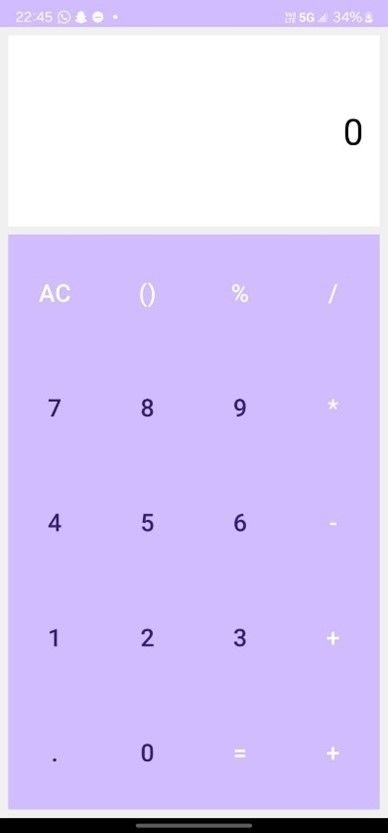

Figure 4.4 Table Layout 

---

# EXPERIMENT NO. 5 
# Apps Interactivity in Android 
# To incorporate element of interactivity using Android Fragment and Intent Class 
**CODE :-**   

**activity_main.xml** 
```xml
<?xml version="1.0" encoding="utf-8"?> 
<FrameLayout xmlns:android="http://schemas.android.com/apk/res/android" 
    android:id="@+id/fragment_container" 
    android:layout_width="match_parent" 
    android:layout_height="match_parent" /> 
```

**fragment_a.xml** 
<?xml version="1.0" encoding="utf-8"?> 
<LinearLayout xmlns:android="http://schemas.android.com/apk/res/android" 
    android:layout_width="match_parent" 
    android:layout_height="match_parent" 
    android:gravity="center" 
    android:orientation="vertical"> 
    <Button 
        android:id="@+id/send_button" 
        android:layout_width="wrap_content" 
        android:layout_height="wrap_content" 
        android:text="Send to FragmentB" /> 
</LinearLayout>
``` 
 
**fragment_b.xml** 
```xml
<?xml version="1.0" encoding="utf-8"?> 
<!-- fragment_b.xml --> 
<LinearLayout xmlns:android="http://schemas.android.com/apk/res/android" 
    android:layout_width="match_parent" 
    android:layout_height="match_parent" 
    android:gravity="center" 
    android:orientation="vertical"> 
    <TextView 
        android:id="@+id/received_data" 
        android:layout_width="wrap_content" 
        android:layout_height="wrap_content" 
        android:text="Data from FragmentA" /> 
</LinearLayout>
```
 

**MainActivity.java** 
```java
package com.example.my_exp5; 
import android.content.Intent; 
import android.os.Bundle; 
import androidx.appcompat.app.AppCompatActivity; 
import androidx.fragment.app.Fragment; 
import androidx.fragment.app.FragmentManager; 
public class MainActivity extends AppCompatActivity { 
    @Override 
    protected void onCreate(Bundle savedInstanceState) { 


 
        super.onCreate(savedInstanceState); 
        setContentView(R.layout.activity_main); 
        // Load FragmentA initially 
        if (savedInstanceState == null) { 
            FragmentManager fragmentManager = getSupportFragmentManager(); 
            fragmentManager.beginTransaction() 
                    .replace(R.id.fragment_container, new FragmentA()) 
                    .commit(); 
        } 
    } 
    // Method to switch to FragmentB 
    public void switchToFragmentB(String data) { 
        FragmentB fragmentB = new FragmentB(); 
        Bundle bundle = new Bundle(); 
        bundle.putString("data_key", data);  // Passing data to FragmentB 
        fragmentB.setArguments(bundle); 
        getSupportFragmentManager().beginTransaction() 
                .replace(R.id.fragment_container, fragmentB) 
                .addToBackStack(null)  // Allows to go back to FragmentA 
                .commit(); 
    } 
}
```
 
**FragmentA.java** 
```java
package com.example.my_exp5; 
 
import android.content.Context; 
import android.os.Bundle; 
import android.view.LayoutInflater; 
import android.view.View; 
import android.view.ViewGroup; 
import android.widget.Button; 
import androidx.annotation.NonNull; 
import androidx.annotation.Nullable; 
import androidx.fragment.app.Fragment; 
public class FragmentA extends Fragment { 
    private MainActivity mainActivity; 
    @Override 
    public void onAttach(@NonNull Context context) { 
        super.onAttach(context); 
        mainActivity = (MainActivity) context; 
    } 
    @Nullable 
    @Override 
    public View onCreateView(@NonNull LayoutInflater inflater, @Nullable ViewGroup container, 
@Nullable Bundle savedInstanceState) { 
        View view = inflater.inflate(R.layout.fragment_a, container, false); 
        Button sendButton = view.findViewById(R.id.send_button); 
        sendButton.setOnClickListener(new View.OnClickListener() { 
            @Override 
            public void onClick(View v) { 


 
                // Switch to FragmentB with some data 
                mainActivity.switchToFragmentB("Hello from FragmentA"); 
            } 
        }); 
        return view; 
    } 
}
``` 
**FragmentB.java** 
```java
package com.example.my_exp5; 
import android.os.Bundle; 
import android.view.LayoutInflater; 
import android.view.View; 
import android.view.ViewGroup; 
import android.widget.TextView; 
import androidx.annotation.NonNull; 
import androidx.annotation.Nullable; 
import androidx.fragment.app.Fragment; 
public class FragmentB extends Fragment { 
    @Nullable 
    @Override 
    public View onCreateView(@NonNull LayoutInflater inflater, @Nullable ViewGroup container, 
@Nullable Bundle savedInstanceState) { 
        View view = inflater.inflate(R.layout.fragment_b, container, false); 
        TextView textView = view.findViewById(R.id.received_data); 
        // Retrieve data from FragmentA 


 
        Bundle bundle = getArguments(); 
        if (bundle != null) { 
            String data = bundle.getString("data_key"); 
            textView.setText(data);  // Displaying the received data 
        } 
        return view; 
    } 
} 
```

**OUTPUT :-** 
 
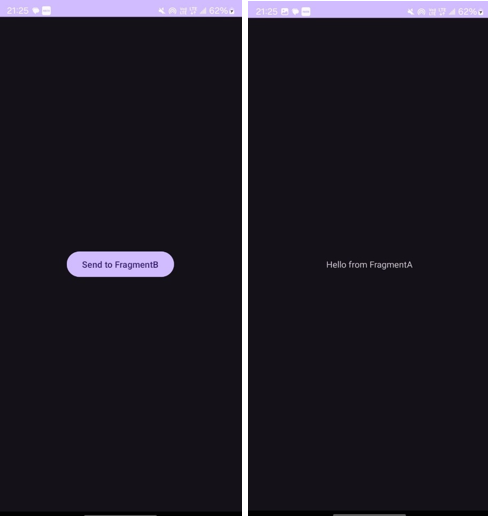

Figure 5.1 Fragments

---

# EXPERIMENT NO. 6 
# Persistent Data Storage 
# To perform database connectivity of android app using SQLite Login and Signup form is created using SQLite database. 
## UI Development (XML code) 
## SignUp form: 
```xml
<?xml version="1.0" encoding="utf-8"?> 
<RelativeLayout xmlns:android="http://schemas.android.com/apk/res/android" 
xmlns:app="http://schemas.android.com/apk/res-auto" 
xmlns:tools="http://schemas.android.com/tools" android:layout_width="match_parent" 
android:layout_height="match_parent" tools:context=".MainActivity"> 
<TextView 
android:id="@+id/login_text" android:layout_width="match_parent" 
android:layout_height="wrap_content" android:text="User Name" 
android:layout_marginTop="200dp" android:layout_marginLeft="50dp" 
android:layout_marginRight="50dp" android:textSize="24dp" 
/> 
<EditText 
android:id="@+id/login" android:layout_width="match_parent" 
android:layout_height="wrap_content" android:layout_marginLeft="50dp" 
android:layout_marginRight="50dp" android:inputType="textPersonName" 
android:layout_below="@+id/login_text"/> 
<TextView 
android:id="@+id/password_text" android:layout_width="match_parent" 
android:layout_height="wrap_content" android:text="Password" android:layout_marginTop="50dp" 
android:layout_marginLeft="50dp" android:layout_marginRight="50dp" android:textSize="24dp" 
android:layout_below="@+id/login" 
/> 
<EditText 
android:id="@+id/password" android:layout_width="match_parent" 
android:layout_height="wrap_content" android:layout_marginLeft="50dp" 
android:layout_marginRight="50dp" android:inputType="textPersonName" 
android:layout_below="@+id/password_text" android:textSize="24dp" 
/> 
<Button 
android:id="@+id/buttonLogin" android:layout_width="match_parent" 
android:layout_height="wrap_content" android:text="Login" android:layout_marginTop="50dp" 
android:layout_marginLeft="50dp" android:layout_marginRight="50dp" 
/> 
</RelativeLayout> 
Login Form: activity login.xml 
<androidx.constraintlayout.widget.ConstraintLayout 
xmlns:android="http://schemas.android.com/apk/res/ android" 
xmlns:app="http://schemas.android.com/apk/res-auto" android:layout_width="match_parent" 
android:layout_height="match_parent" android:background="#16181C"> 
<ScrollView 
android:layout_width="match_parent" android:layout_height="match_parent" 
app:layout_constraintBottom_toBottomOf="parent" app:layout_constraintEnd_toEndOf="parent" 
app:layout_constraintStart_toStartOf="parent" app:layout_constraintTop_toTopOf="parent"> 
<LinearLayout android:layout_width="match_parent" android:layout_height="wrap_content" 
android:orientation="vertical" > 
<ImageView 
android:id="@+id/imageView3" android:layout_width="match_parent" 
android:layout_height="wrap_content" app:srcCompat="@drawable/logo2" /> 
<TextView 
android:id="@+id/textView2" android:layout_width="match_parent" 
android:layout_height="wrap_content" android:layout_margin="25dp" 
android:fontFamily="@font/squre" android:text="Login Into \nYour Wallet" 
android:textColor="#FFFFFF" android:textSize="35sp" /> 
<LinearLayout android:layout_width="match_parent" android:layout_height="wrap_content" 
android:layout_marginStart="32dp" android:layout_marginEnd="32dp" 
android:layout_marginBottom="32dp" android:background="@drawable/input_bg" 
android:orientation="vertical"> 
<EditText 
android:id="@+id/login_email" android:layout_width="match_parent" 
android:layout_height="50dp" android:layout_marginStart="24dp" 
android:layout_marginTop="24dp" android:layout_marginEnd="24dp" 
android:background="@drawable/input_fields" android:drawableLeft="@drawable/email" 
android:drawablePadding="16dp" android:ems="10" 
android:hint="Email" android:inputType="textEmailAddress" android:paddingLeft="16dp" 
android:textColor="#FFFFFF" android:textColorHint="#FFFFFF" /> 
<EditText 
android:id="@+id/login_pass" android:layout_width="match_parent" android:layout_height="50dp" 
android:layout_marginStart="24dp" android:layout_marginTop="24dp" 
android:layout_marginEnd="24dp" android:background="@drawable/input_fields" 
android:drawableLeft="@drawable/password" android:drawablePadding="16dp" android:ems="10" 
android:hint="Password" android:inputType="textPassword" android:paddingLeft="16dp" 
android:textColor="#FFFFFF" android:textColorHint="#FFFFFF" /> 
<LinearLayout android:layout_width="match_parent" android:layout_height="wrap_content" 
android:gravity="center" android:orientation="horizontal"> 
<ImageView 
android:id="@+id/imageView5" android:layout_width="wrap_content" 
android:layout_height="wrap_content" android:layout_margin="25dp" 
app:srcCompat="@drawable/facebook" /> 
<ImageView 
android:id="@+id/imageView4" android:layout_width="wrap_content" 
android:layout_height="wrap_content" android:layout_margin="25dp" 
app:srcCompat="@drawable/google" /> 
</LinearLayout> 
<TextView 
android:id="@+id/register_link" android:layout_width="wrap_content" 
android:layout_height="wrap_content" android:layout_gravity="center" 
android:layout_marginBottom="20dp" android:layout_weight="1" android:text="Are you a new 
User? Register" android:textAlignment="center" android:textColor="#9D94FD" 
android:textSize="18sp" android:textStyle="bold" /> 
<Button 
android:id="@+id/login_btn" style="@android:style/Widget.Button" 
android:layout_width="match_parent" android:layout_height="match_parent" 
android:layout_marginStart="20dp" 
android:layout_marginEnd="20dp" android:layout_marginBottom="20dp" 
android:background="@drawable/bg_btn" android:text="Login" android:textColor="#FFFFFF" 
android:textSize="24sp" android:textStyle="bold" /> 
<TextView 
android:id="@+id/textView4" android:layout_width="match_parent" 
android:layout_height="wrap_content" android:layout_marginBottom="32dp" android:text="Forgot 
Password? Recover it." android:textAlignment="center" android:textColor="#FFFFFF" /> 
</LinearLayout> 
</LinearLayout> 
</ScrollView> 
</androidx.constraintlayout.widget.ConstraintLayout>
``` 

**Java Code MainActivity.java** 
```java
package com.gne.myform; 
import androidx.annotation.NonNull; 
import androidx.appcompat.app.AppCompatActivity; 
public class MainActivity extends AppCompatActivity { EditText loginText,PasswordText; Button btnLogin; 
@Override 
protected void onCreate(Bundle savedInstanceState) { 
    super.onCreate(savedInstanceState); 
    setContentView(R.layout.activity_main); 
    loginText = (EditText) findViewById(R.id.login); 
    EditText passwordText = (EditText) findViewById(R.id.password); 
    btnLogin = (Button) findViewById(R.id.buttonLogin); 
    btnLogin.setOnClickListener(new View.OnClickListener() { 
        @Override 
        public void onClick(View view) { 
            String username = loginText.getText().toString(); 
            String password = passwordText.getText().toString(); 
            if (username.equals("Kirandeep") && password.equals("123456")) { 
                Toast.makeText(MainActivity.this, "Welcome", Toast.LENGTH_SHORT).show(); 
                Intent intent = new Intent(getApplicationContext(), NewActivity.class); 
                startActivity(intent); 
            } else { 
                Toast.makeText(MainActivity.this, "Invalid Credentials", 
Toast.LENGTH_SHORT).show(); 
            } 
        } 
    }); 
}
```
 
**New Activity - XML** 
```xml
<?xml version="1.0" encoding="utf-8"?> 
<androidx.constraintlayout.widget.ConstraintLayout 
xmlns:android="http://schemas.android.com/apk/res/ android" 
xmlns:app="http://schemas.android.com/apk/res-auto" 
xmlns:tools="http://schemas.android.com/tools" android:layout_width="match_parent" 
android:layout_height="match_parent" tools:context=".NewActivity"> 
</androidx.constraintlayout.widget.ConstraintLayout>
``` 

**OUTPUT:** 

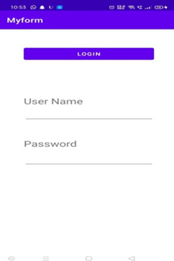

Figure 6.1 Registration Form 

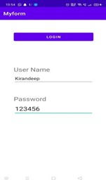

Figure 6.2 Login Form 


  
Figure 6.3 Main activity after login 

---

# EXPERIMENT NO. 7 
# Android Services and Threads 
# To implement the concept of multithreading using Android Service class 
**XML Code:** 
```xml
<LinearLayout android:layout_width="match_parent" android:layout_height="match_parent" 
android:orientation="vertical" > 
<ImageView 
android:id="@+id/imageView" android:layout_width="250dp" android:layout_height="250dp" 
android:layout_margin="50dp" android:layout_gravity="center" /> 
<Button 
android:id="@+id/button" android:layout_width="wrap_content" 
android:layout_height="wrap_content" android:layout_margin="10dp" 
android:layout_gravity="center" android:text="Down the memory lane" /> 
<Button 
android:id="@+id/button2" android:layout_width="wrap_content" 
android:layout_height="wrap_content" android:layout_margin="10dp" 
android:layout_gravity="center" android:text="Trip to Kasauli" /> 
</LinearLayout> 
```
**Java Code:** 
```java
package com.gne.multithreading; 
import android.os.Bundle; 
import android.view.View; 
import android.widget.Button; 
import android.widget.ImageView; 
import androidx.appcompat.app.AppCompatActivity; 
public class MainActivity extends AppCompatActivity { 
 
    ImageView img; 
    Button bt1, bt2; 
    @Override 
    protected void onCreate(Bundle savedInstanceState) { 
        super.onCreate(savedInstanceState); 
        setContentView(R.layout.activity_main); 
        bt1 = (Button) findViewById(R.id.button); 
        bt2 = (Button) findViewById(R.id.button2); 
        img = (ImageView) findViewById(R.id.imageView); 
        bt1.setOnClickListener(new View.OnClickListener() { 
            @Override 
            public void onClick(View v) { 
                new Thread(new Runnable() { 
                    @Override 
                    public void run() { 
                        img.post(new Runnable() { 
                            @Override 
                            public void run() { 
                                img.setImageResource(R.drawable.kasauli); 
                            } 
                        }); 
                    } 
                }).start(); 
            } 
        }); 


 
        bt2.setOnClickListener(new View.OnClickListener() { 
            @Override 
            public void onClick(View v) { 
                new Thread(new Runnable() { 
                    @Override 
                    public void run() { 
                        img.post(new Runnable() { 
                            @Override 
                            public void run() { 
                                img.setImageResource(R.drawable.kasauli2); 
                            } 
                        }); 
                    } 
                }).start(); 
            } 
        }); 
    } 
}
```
**Output:** 

  
Figure 7.1 Main page 

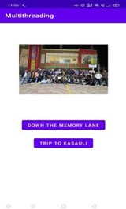

Figure 7.2 Activity State 1 


 
Figure 7.3 Activity State 2 

---

# EXPERIMENT NO. 8 
# Android Security and Debugging 
# To implement concept of permission and perform request for permission to access different hardware components of mobile 
## **1. Declare the permission in the Android Manifest file:** In Android, permissions are declared in the AndroidManifest.xml file using the uses-permission tag. 
```xml
<!--Declaring the required permissions--> 
<uses-permission android:name="android.permission.READ_EXTERNAL_STORAGE" /> 
<uses-permission android:name="android.permission.WRITE_EXTERNAL_STORAGE" /> 
<uses-permission android:name="android.permission.CAMERA" />
``` 
## **2. Modify activity main.xml file to Add two buttons to request permission on button click:** Permission will be checked and requested on button click. Open the activity main.xml file and add two buttons to it. 
## **3. Check whether permission is already granted or not:** If permission isn’t already granted, request the user for the permission: In order to use any service or feature, the permis- sions are required. Hence we have to ensure that the permissions are given for that. If not, then the permissions are requested. 
## **4. Check for permissions:** Beginning with Android 6.0 (API level 23), the user has the right to revoke permissions from any app at any time, even if the app targets a lower API level. So to use the service, the app needs to check for permissions every time. 
```java
// Function to check and request permission 
public void checkPermission(String permission, int requestCode) 
{ 
// Checking if permission is not granted 
if (ContextCompat.checkSelfPermission(MainActivity.this, permission) == PackageManager. 
PERMISSION_DENIED) { 


 
ActivityCompat.requestPermissions(MainActivity.this, new String[] { permission }, 
requestCode); 
} 
else { 
Toast.makeText(MainActivity.this, "Permission already granted", 
Toast.LENGTH_SHORT).show(); 
} 
}
```
## **5. Override onRequestPermissionsResult() method:** onRequestPermissionsResult() is called when user grant or decline the permission. RequestCode is one of the parameters of this function which is used to check user action for the corresponding requests. Here a toast message is shown indicating the permission and user action. 

**OUTPUT:** 

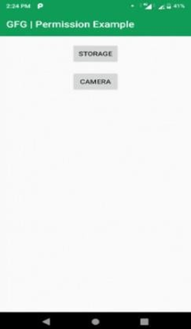

Figure 8.1 Main Activity 

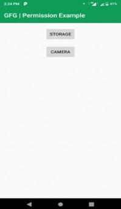
 
Figure 8.2 Permission Dialog Box 
 
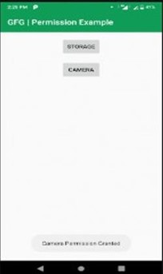
 
Figure 8.3 Toast Message for Permission 

---
 
# EXPERIMENT NO. 9 
# Android Security and Debugging 
# To perform debugging and testing of android app using tools like Logcat, Android debug bridge, DDMS Logcat is an important tool in Android studio. Logcat helps developers to debug the code when an application is not running or has crashed. Steps to run Logact in Android Studio:- 
## 1. Create new project in android studio and select empty activity. 

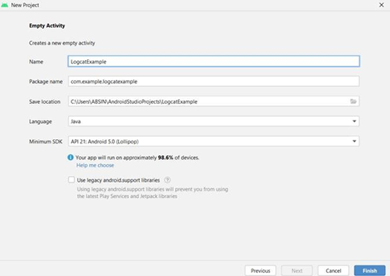

Figure 9.1 Creating a Project 
## 2. Now go to activity main.xml. By default we get a textview so just set the id of this textview. 
```xml
<?xml version="1.0" encoding="utf-8"?> 
<androidx.constraintlayout.widget.ConstraintLayout 
xmlns:android="http://schemas.android.com/apk/res/ android" 
xmlns:app="http://schemas.android.com/apk/res-auto" 
xmlns:tools="http://schemas.android.com/tools" android:layout_width="match_parent" 
android:layout_height="match_parent" tools:context=".MainActivity"> 
<TextView 
android:id="@+id/textview" android:layout_width="wrap_content" 
android:layout_height="wrap_content" android:text="Hello World!" 
app:layout_constraintBottom_toBottomOf="parent" 
app:layout_constraintEnd_toEndOf="parent" app:layout_constraintStart_toStartOf="parent" 
app:layout_constraintTop_toTopOf="parent" /> 
</androidx.constraintlayout.widget.ConstraintLayout>
``` 
## 3. Now go to MainActivity.java. Create a Textview object and same time initialize with the help of findViewById() method. 
```java
package com.example.logcatexample;
import androidx.appcompat.app.AppCompatActivity;
import android.os.Bundle;
import android.widget.EditText;
import android.widget.TextView;
public class MainActivity extends AppCompatActivity {
    TextView textView;

    @Override
    protected void onCreate(Bundle savedInstanceState) {
        super.onCreate(savedInstanceState);
        setContentView(R.layout.activity_main);
        textView = findViewById(R.id.textview);
    }
}
``` 
## 4. Now connect any physical or virtual device to android studio and click on Run button. The application is installed however immediately crashed. 
## 5. Open Logcat and again click on run button. In logcat some line of code is generated so we have to find out the line that tells us which line of code contains error. Sometimes we need to scroll up in locat window to find out the error. Examine the below picture carefully and an orange color arrow indicate an error line. 

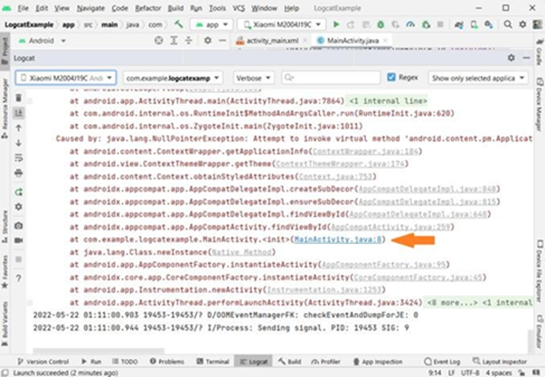

Figure 9.2 Logcat After Running 
 
## 6. Go to MainActivity.java and added the below code inside onCreate() method. 
 
```java
Log.v("MainActivity1","Inside onCreate()"); Log.d("MainActivity2","Inside onCreate()"); 
Log.i("MainActivity3","Inside onCreate()"); Log.w("MainActivity4","Inside onCreate()"); 
Log.e("MainActivity5","Inside onCreate()");
``` 
## 7. Now run the application and open logcat window. In logcat we have a search option where we can check easily if message is printed or not by writing TAG name in search option. 

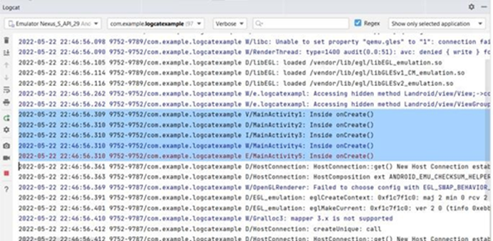

Figure 9.3 Logcat Window 
 
